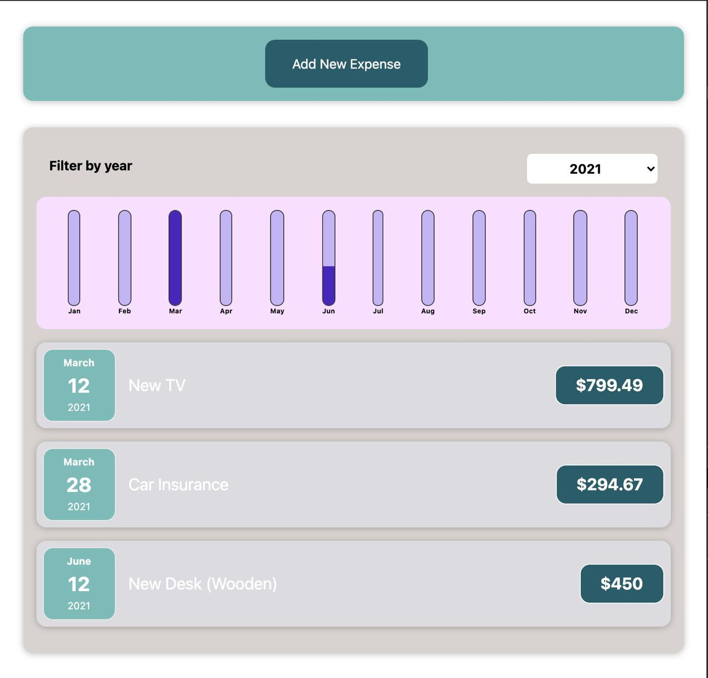
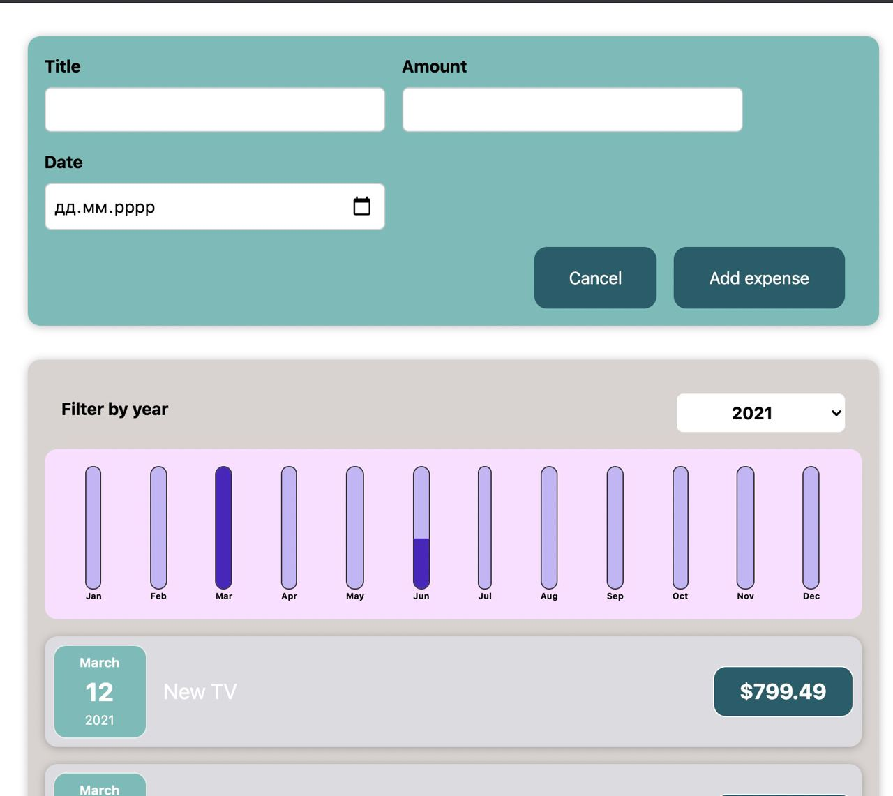
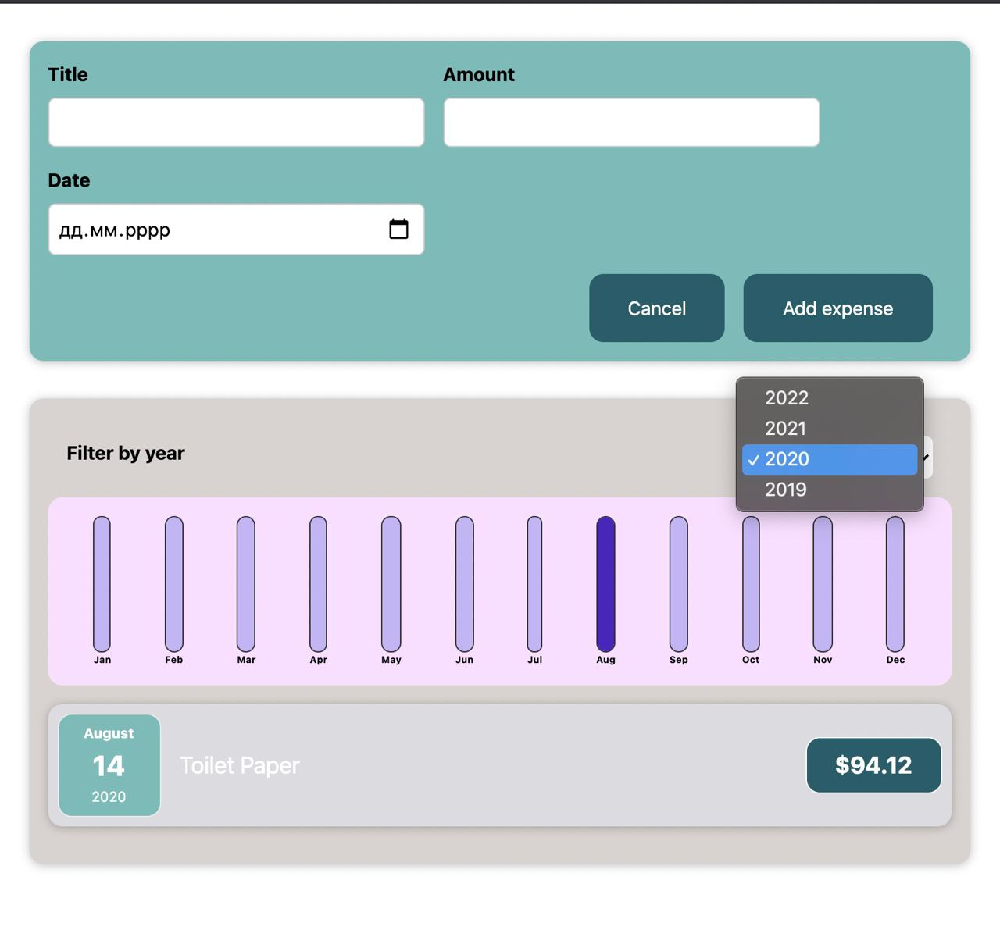

# Expenses app

Front-end for an expenses tracking app.\
Written using **React**.\
A complete practice project  developed during Udemy course React - The Complete Guide (incl Hooks, React Router, Redux) (section 8)
### Interface

Adding new expense:

Filtering:

